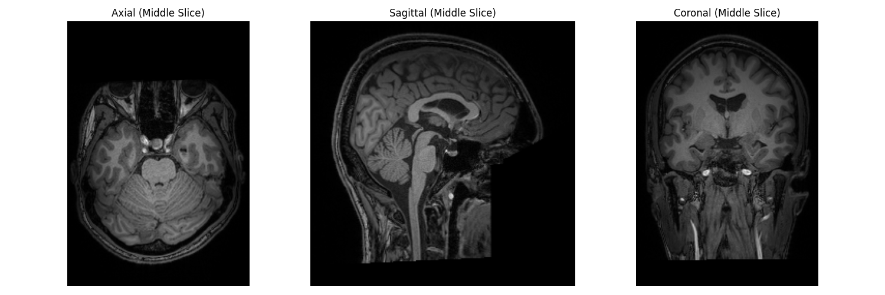

## Overview
### STUDY DESCRIPTION
A within-subjects-design involving a two-week baseline period before the running intervention, and two subsequent intervention cycles was applied. At four time points of assessment (t1: start of the study; t2: end of baseline period/start of the intervention; t3: end of the first intervention cycle; t4: end of the 2nd intervention cycle/study end) magnetic resonance imaging was performed and symptoms related to depression were assessed employing the Center for Epidemiological Studies Depression (CES-D) Scale. The intervention resulted in a significant increase in the estimated maximum oxygen uptake (VO2-Max), measured with a standardized walking test.
### DATASET DESCRIPTION
* This dataset includes demographic data, data of the CES-D Questionnaire, vo2max and T1 weighted MRI data
* The numbers 1-20 in the CES-D (Center for Epidemiologic Studies Depression Scale) refer to 20 different questions or items that assess various symptoms of depression. Each item corresponds to a specific depressive symptom or experience. Here's a general breakdown of what these items typically represent:
  * Bothered by things
  * Appetite was poor
  * Couldn't shake off the blues
  * Felt as good as others (reverse scored)
  * Trouble focusing
  * Felt depressed
  * Everything was an effort
  * Hopeful about the future (reverse scored)
  * Life had been a failure
  * Felt fearful
  * Sleep was restless
  * Happy (reverse scored)
  * Talked less than usual
  * Felt lonely
  * People were unfriendly
  * Enjoyed life (reverse scored)
  * Had crying spells
  * Felt sad
  * Felt that people disliked me
  * Couldn't get "going"
* Each item is scored from 0 to 3 based on the frequency of experiencing that symptom in the past week:
  * 0 = Rarely or none of the time (less than 1 day)
  * 1 = Some or a little of the time (1-2 days)
  * 2 = Occasionally or a moderate amount of time (3-4 days)
  * 3 = Most or all of the time (5-7 days)

## Table of Contents

### Data Visualization

### CESD Scores by Session for Participant sub-119BPAF161001

| Participant ID     | Session ID | CESD_01 | CESD_02 | CESD_03 | CESD_04 | CESD_05 | CESD_06 | CESD_07 | CESD_08 | CESD_09 | CESD_10 | CESD_11 | CESD_12 | CESD_13 | CESD_14 | CESD_15 | CESD_16 | CESD_17 | CESD_18 | CESD_19 | CESD_20 | Total Score |
|--------------------|------------|---------|---------|---------|---------|---------|---------|---------|---------|---------|---------|---------|---------|---------|---------|---------|---------|---------|---------|---------|---------|
| sub-119BPAF161001  | 4          | 0       | 0       | 0       | 1       | 0       | 0       | 0       | 1       | 0       | 0       | 1       | 1       | 0       | 0       | 0       | 0       | 1       | 1       | 0       | 0       | 5           |
| sub-119BPAF161001  | 3          | 0       | 0       | 0       | 0       | 0       | 0       | 0       | 1       | 0       | 0       | 1       | 1       | 0       | 0       | 0       | 0       | 0       | 0       | 0       | 0       | 2           |
| sub-119BPAF161001  | 2          | 1       | 0       | 0       | 1       | 0       | 0       | 1       | 1       | 0       | 0       | 1       | 1       | 0       | 0       | 0       | 0       | 1       | 1       | 0       | 0       | 8           |
| sub-119BPAF161001  | 1          | 1       | 0       | 0       | 0       | 0       | 0       | 1       | 1       | 0       | 0       | 1       | 1       | 1       | 1       | 0       | 2       | 0       | 0       | 1       | 1       | 12          |

### Full Total Scores:
- **Session 4:** 5
- **Session 3:** 2
- **Session 2:** 8
- **Session 1:** 12

### Challenge with this Dataset
* Longitudinal Analysis of Hippocampal Volume:
  * Use FreeSurfer to segment hippocampal volumes across all time points
  * Apply linear mixed-effects models to assess changes in hippocampal volume over time, considering the intervention periods
  * Correlate volume changes with changes in CES-D scores and VO2-Max. 
* Voxel-Based Morphometry (VBM) Analysis:
  * Use SPM or FSL to perform VBM analysis across all time points.
  * Investigate whole-brain gray matter density changes related to the intervention.
  * Correlate regional gray matter changes with CES-D and VO2-Max improvements.
* Machine Learning for Intervention Response Prediction:
  * Use baseline MRI features and initial CES-D scores to predict who will respond best to the intervention.
  * Apply techniques like Support Vector Machines or Random Forests with careful cross-validation.
  * Focus on interpretable features that could guide future intervention strategies.
* Deep Learning for MRI Feature Extraction:
  * Utilize a pre-trained 3D convolutional neural network (e.g., 3D ResNet) to extract features from T1 images.
  * Use these features in a simpler model to predict CES-D changes or VO2-Max improvements.
  * This leverages the power of deep learning while mitigating small sample size issues.
* Network Analysis of Structural Covariance:
  * Construct structural covariance networks based on cortical thickness or gray matter density.
  * Analyze how these networks change over the course of the intervention.
  * Correlate network metrics with behavioral outcomes.
* Multivariate Pattern Analysis (MVPA):
  * Use MVPA techniques to identify patterns of brain structure associated with depression symptoms or fitness levels.
  * Investigate how these patterns change with the intervention.
* Mediation Analysis:
  * Investigate if changes in brain structure mediate the relationship between improved fitness (VO2-Max) and reduced depressive symptoms (CES-D).
* Longitudinal Tensor-Based Morphometry:
  * Apply TBM to quantify local brain changes over time.
  * Relate these changes to both the intervention and symptom improvements.
* Individual Differences in Intervention Response:
  * Use clustering techniques to identify subgroups of responders and non-responders.
  * Characterize these groups based on baseline brain structure and behavioral measures.
* Multi-Modal Integration:
  * Combine structural MRI features with behavioral and demographic data.
  * Use techniques like Partial Least Squares or Canonical Correlation Analysis to find relationships betwe